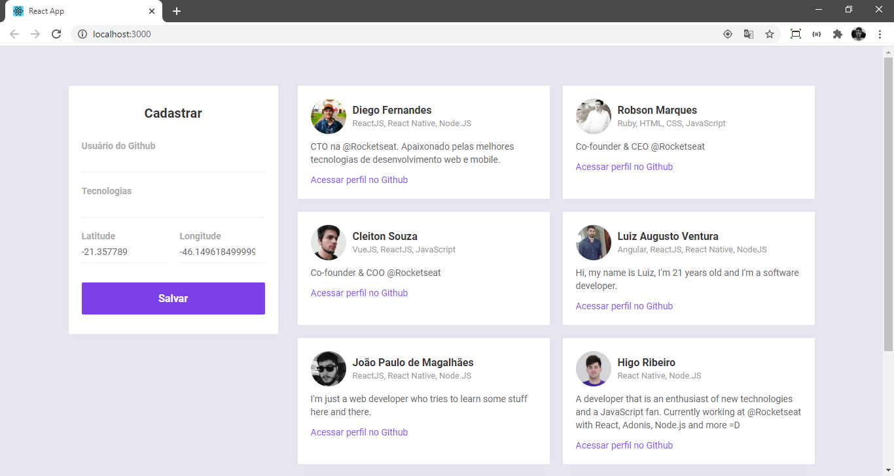
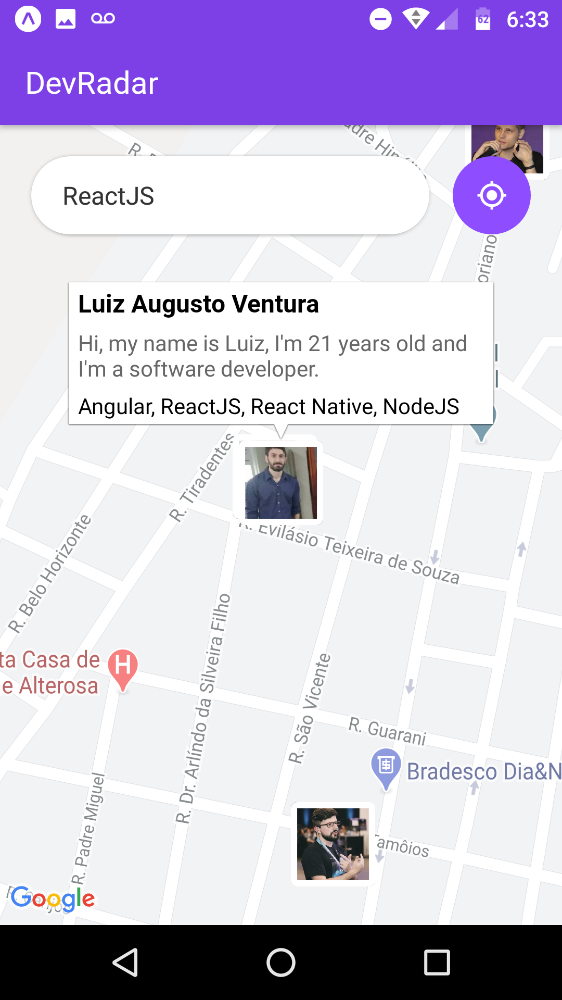
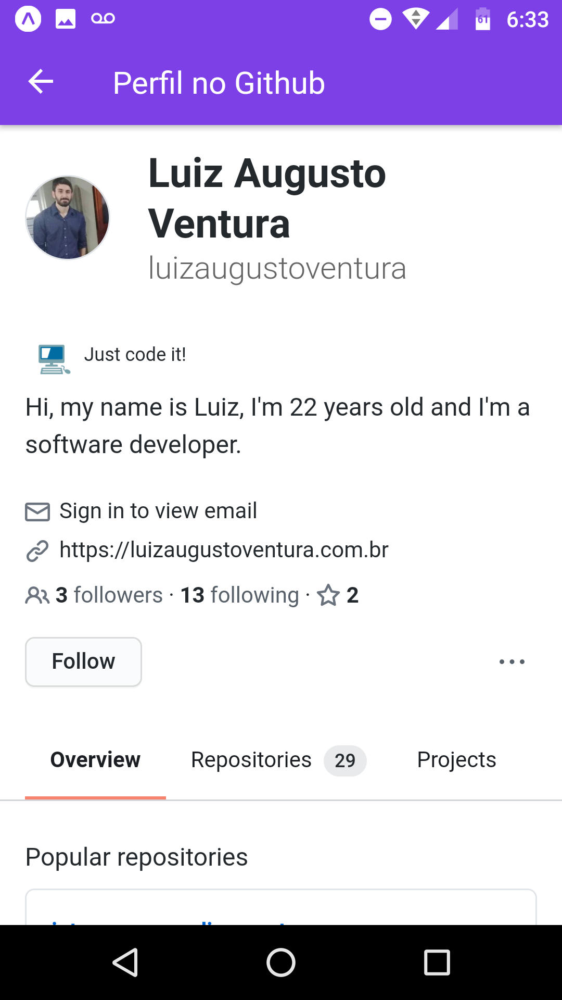

<h1
    align="center"
    style="color: #7129C1;"
>
    🗺 DevRadar: Econtre o dev que você tanto precisa 💻
</h1>

<h3
    style="color: #6018B0;"
>
    Encontre devs na sua região de acordo com as tecnologias que você precisa com apenas alguns cliques!
</h3>

Desenvolvido durante a Semana OmniStack 8 (evento realizado pela Rocketseat), o DevRadar é uma aplicação que usa os mapas da API do Expo para filtrar buscas de devs de acordo com as tecnologias desejadas.

<h4>🛠 Ferramentas e tecnologias: 🛠</h4>
<ul>
    <li>Node.JS e Express</li>
    <li>MongoDB e Mongoose</li>
    <li>ReactJS</li>
    <li>React Native</li>
    <li>Expo CLI</li>
</ul>

<h4>📑 Recursos adicionais: ⌨</h4>
<ul>
    <li>
        Configuração das atualizações em tempo real dentro da aplicação com <strong>Socket.IO</strong>
    </li>
</ul>

<h4>📷 Capturas de tela: 📷</h4>
<table>
    <tr>
        <td align="center"><strong>Aplicação web</strong></td>
    </tr>
    <tr>
        <td>
            
        </td>
    </tr>
</table>

<table>
    <tr>
        <td colspan="3" align="center"><strong>Aplicação mobile</strong></td>
    </tr>
    <tr>
        <td>
            
        </td>
        <td>
            
        </td>
        <td>
            
        </td>
    </tr>
</table>